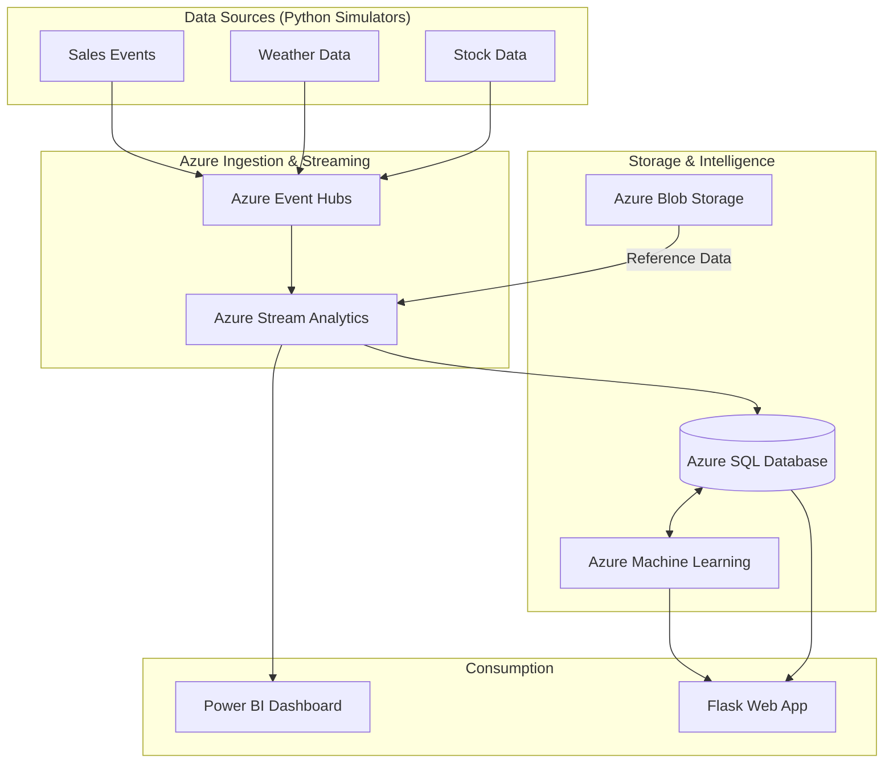

# 📊 Azure Real-time Sales Analytics & Forecasting System


> **Giải pháp phân tích dữ liệu bán hàng thời gian thực toàn diện (End-to-End) trên nền tảng Cloud Native Azure.** Hệ thống tích hợp luồng dữ liệu từ thu thập (Ingestion), xử lý (ETL Streaming), dự báo thông minh (ML Forecasting) đến trực quan hóa chuyên sâu trên Power BI và Web App.

---

## 📋 Mục lục

- [🎯 Tổng quan](#-tổng-quan)
- [🏗️ Kiến trúc hệ thống](#-kiến-trúc-hệ-thống)
- [📁 Cấu trúc dự án](#-cấu-trúc-dự-án)
- [✅ Yêu cầu tiên quyết](#-yêu-cầu-tiên-quyết)
- [🚀 Hướng dẫn triển khai](#-hướng-dẫn-triển-khai)
- [🤖 Local-First MLOps & CT](#-local-first-mlops--ct)
- [⚙️ Các dịch vụ Azure](#️-các-dịch-vụ-azure)
- [📚 Tài liệu tham khảo](#-tài-liệu-tham-khảo)

---

## 🎯 Tổng quan

Hệ thống được thiết kế để xử lý hàng nghìn sự kiện mỗi giây, kết hợp dữ liệu bán hàng với các yếu tố ngoại vi (thời tiết, chứng khoán) để đưa ra dự báo doanh thu chính xác.

| Thành phần | Công nghệ | Vai trò chủ chốt |
|---|---|---|
| 📡 **Data Ingestion** | Azure Event Hubs | Tiếp nhận luồng dữ liệu Sales, Weather, Stock thời gian thực. |
| 🔄 **ETL Streaming** | Azure Stream Analytics | Xử lý Windowing, Join đa luồng và phát hiện bất thường (Anomaly Detection). |
| 🤖 **AI Forecasting** | Azure Machine Learning | Mô hình Gradient Boosting dự báo doanh thu 24h tới qua REST Endpoint. |
| 🗄️ **Storage** | Azure SQL & Blob Storage | Lưu trữ Hybrid: Dữ liệu đã xử lý (SQL) và dữ liệu thô/tham chiếu (Blob). |
| 📊 **Visualization** | Power BI & Flask App | Dashboard thời gian thực và giao diện tương tác người dùng. |
| ⚙️ **Orchestration** | Azure Data Factory | Tự động hóa pipeline sao lưu và huấn luyện lại mô hình theo lịch. |

---

## 🏗️ Kiến trúc hệ thống



---

## 📁 Cấu trúc dự án

> [!NOTE]
> Cấu trúc dưới đây tập trung vào các thành phần chức năng chính của hệ thống.

```text
azure-realtime-sales-analytics/
├── 📂 config/               # Cấu hình hệ thống và quản lý biến môi trường
├── 📂 data_generator/       # Bộ giả lập dữ liệu Sales, Weather và Stock
├── 📂 blob_storage/         # Scripts quản lý Data Lake và Reference Data
├── 📂 stream_analytics/     # Logic xử lý ETL Streaming và SQL Query thời gian thực
├── 📂 sql/                  # Định nghĩa Schema, Stored Procedures và Views
├── 📂 ml/                   # Huấn luyện mô hình, Evaluation và Scoring logic
├── 📂 mlops/                # Tự động hóa: Drift Detection và Continuous Training
├── 📂 azure_functions/      # Serverless Functions cho kiểm định dữ liệu
├── 📂 data_factory/         # Định nghĩa các Pipeline điều phối (Orchestration)
├── 📂 infrastructure/       # Infrastructure as Code (ARM templates, Scripts)
├── 📂 monitoring/           # Telemetry, Logging và giám sát sức khỏe hệ thống
├── 📂 powerbi/              # Scripts đẩy dữ liệu và tài liệu cấu hình Dashboard
├── 📂 webapp/               # Giao diện Flask dự báo doanh thu thời gian thực
├── 📂 benchmarks/           # Công cụ đo lường hiệu năng và độ trễ (Latency)
└── 📂 .github/              # Workflow CI/CD (GitHub Actions)
```

---

## ✅ Yêu cầu tiên quyết

- **Python 3.10+**
- **Azure CLI** (đã `az login`)
- **ODBC Driver 18** for SQL Server
- **Azure Subscription** (Có quyền Contributor)
- **Power BI Pro/Premium** (Để sử dụng Real-time Streaming)

---

## 🚀 Hướng dẫn triển khai

### 1. Khởi tạo môi trường
```bash
pip install -r requirements.txt
cp .env.example .env
```

### 2. Triển khai hạ tầng (IaC)
Sử dụng script tự động để tạo Resource Group, Event Hubs, SQL, Stream Analytics, v.v.
- **Windows:** `.\infrastructure\deploy_azure.ps1`
- **Linux/macOS:** `./infrastructure/deploy_azure.sh`

### 3. Cấu hình Database & Dữ liệu
- Chạy các scripts trong `sql/` để khởi tạo bảng và view.
- Upload dữ liệu tham chiếu: `python blob_storage/upload_reference_data.py`.

### 4. Kích hoạt luồng dữ liệu
Mở các terminal riêng biệt để chạy bộ sinh dữ liệu:
```bash
python data_generator/sales_generator.py
python data_generator/weather_generator.py
| High-value anomaly | — | Phát hiện đơn hàng giá trị cao |
| Revenue spike | Sliding 5m | Phát hiện đột biến doanh thu |
| Weather store | — | Lưu dữ liệu thời tiết vào SQL |
| Stock store | — | Lưu dữ liệu chứng khoán vào SQL |
| Power BI stream | — | Đẩy dữ liệu real-time sang Power BI |
| Weather-Sales JOIN | Tumbling 1h | Tương quan thời tiết × doanh thu |

### 3️⃣ Machine Learning

| Thông tin | Chi tiết |
|---|---|
| **Thuật toán** | Gradient Boosting Regressor |
| **Input features** | Giờ, ngày, tháng, vùng, danh mục, thời tiết |
| **Output** | Dự đoán doanh thu + số lượng cho 24h tới |
| **Endpoint** | Azure ML Online Endpoint (REST API) |

### 4️⃣ Trực quan (Power BI)

| Chế độ | Mô tả |
|---|---|
| **DirectQuery** | Truy vấn trực tiếp Azure SQL, luôn cập nhật |
| **Streaming** | Nhận dữ liệu real-time từ Stream Analytics |
| **Push** | Script Python đẩy dữ liệu tổng hợp định kỳ |

---

## ☁️ Các dịch vụ Azure

| Dịch vụ | Loại | Vai trò | Tier |
|---|---|---|---|
| **Event Hubs** | PaaS | Thu thập sự kiện real-time | Standard (1 TU) |
| **Blob Storage** | PaaS | Reference data & archive | Standard LRS |
| **Stream Analytics** | PaaS | ETL streaming real-time | Standard (6 SU) |
| **SQL Database** | PaaS | Lưu trữ dữ liệu đã xử lý | S1 (20 DTU) |
| **Data Factory** | PaaS | Điều phối pipeline tự động | Pay-as-you-go |
| **Machine Learning** | PaaS | Huấn luyện & triển khai ML | Pay-as-you-go |
| **Power BI** | SaaS | Dashboard & trực quan hóa | Pro/Premium |

> 💰 **Chi phí ước tính:** ~$216/tháng (xem chi tiết tại [`docs/toi_uu_luu_tru.md`](docs/toi_uu_luu_tru.md))

---

## �� Tài liệu

| Tài liệu | Mô tả |
|---|---|
| [`docs/ly_thuyet_va_phan_loai.md`](docs/ly_thuyet_va_phan_loai.md) | Cơ sở lý thuyết: IaaS/PaaS/SaaS, Gradient Boosting, Streaming |
| [`docs/toi_uu_luu_tru.md`](docs/toi_uu_luu_tru.md) | Chiến lược tối ưu: indexing, partitioning, compression, cost |
| [`docs/de_cuong_bao_cao.md`](docs/de_cuong_bao_cao.md) | Đề cương báo cáo Word và slide thuyết trình |
| [`docs/ke_hoach_mlops.md`](docs/ke_hoach_mlops.md) | Lộ trình phát triển MLOps (CI/CD, monitoring, auto-retrain) |
| [`powerbi/POWERBI_SETUP.md`](powerbi/POWERBI_SETUP.md) | Hướng dẫn cấu hình Power BI, RLS, Mobile layout |

---

## 🔗 Tài liệu tham khảo

- 📖 [Azure Event Hubs — Parquet Capture](https://learn.microsoft.com/en-us/azure/stream-analytics/event-hubs-parquet-capture-tutorial)
- 📖 [Stream Analytics — Real-time Fraud Detection](https://learn.microsoft.com/en-us/azure/stream-analytics/stream-analytics-real-time-fraud-detection)
- 📖 [Demand Forecasting Architecture](https://learn.microsoft.com/en-us/azure/architecture/solution-ideas/articles/demand-forecasting)
- 📖 [Azure ML — Online Endpoints](https://learn.microsoft.com/en-us/azure/machine-learning/how-to-deploy-online-endpoints)
- 📖 [Power BI — Streaming Datasets](https://learn.microsoft.com/en-us/power-bi/connect-data/service-real-time-streaming)
