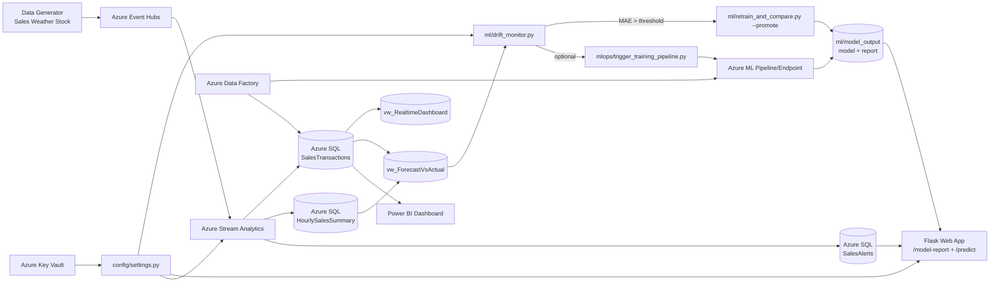

# Kien Truc Tong The (Ban Bao Ve)

Tai lieu nay dung cho slide bao ve, bo sung ro 2 luong quan trong:
- Drift Monitor -> Auto Retrain -> Promote model
- Key Vault -> cap secret cho app/pipeline thay vi hardcode

## Mermaid Diagram

## Checklist nhanh truoc demo

1. Stream Analytics da map output `SalesAlertsOutput` -> bang `dbo.SalesAlerts`.
2. SQL da tao bang `SalesAlerts` va view `vw_ForecastVsActual`.
3. Key Vault co cac secret:
   - `sql-admin-password`
   - `event-hub-connection-string`
   - `blob-connection-string`
4. Chay `python ml/drift_monitor.py --trigger-mode both` de kiem tra vong CT.
5. Mo `http://localhost:5000/model-report` de trinh bay ket qua retrain moi nhat.
